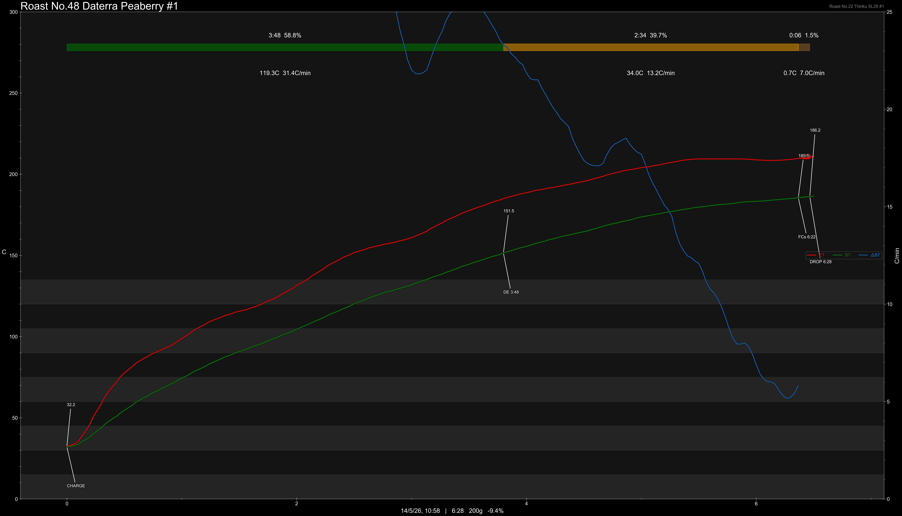
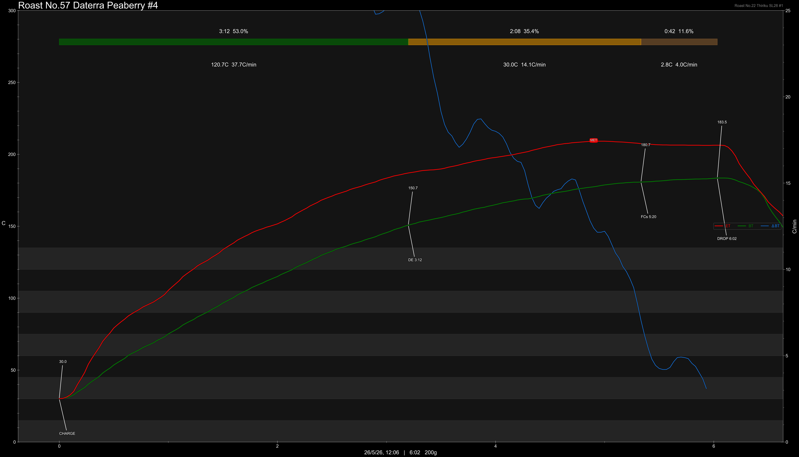
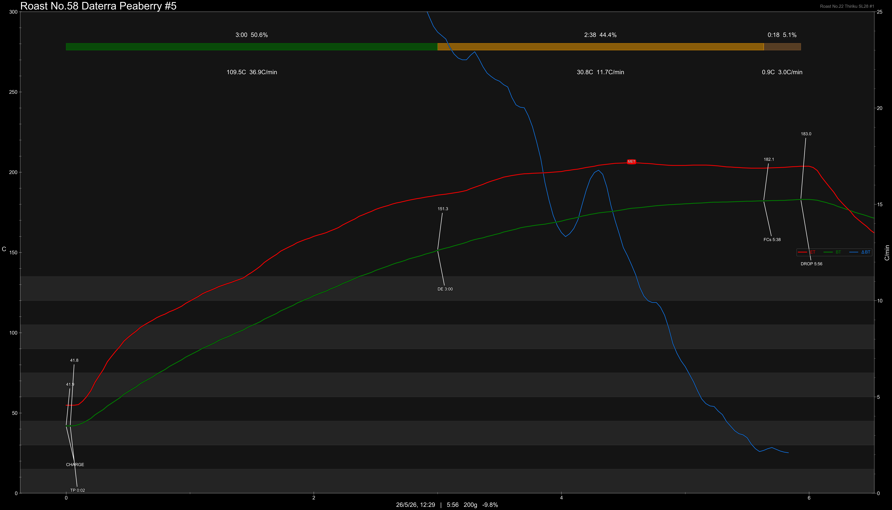
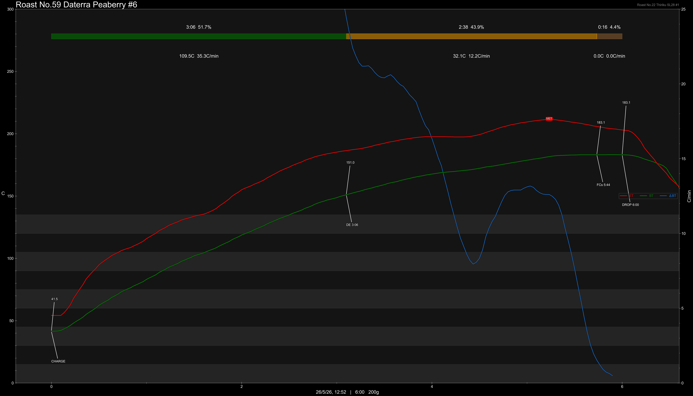
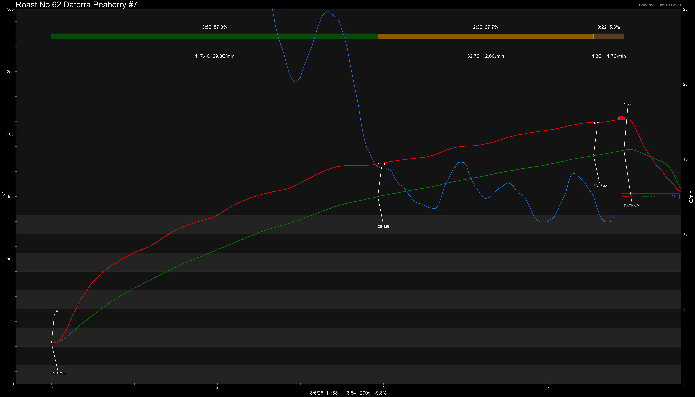
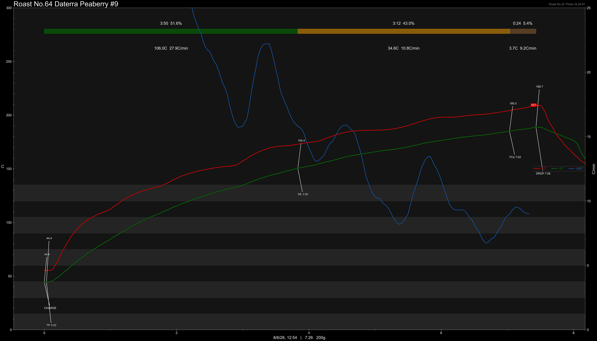
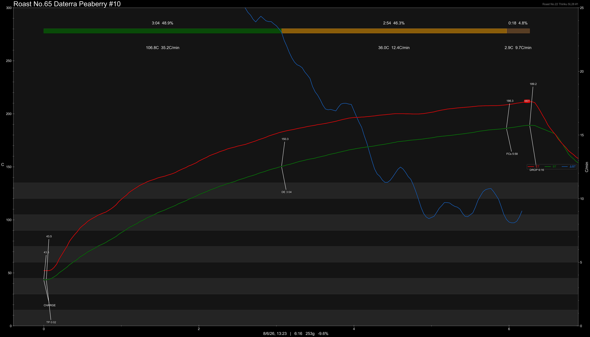

# Brazil Daterra Peaberry Natural & Pulped

Origin: Brazil

Region: Daterra

Farm / Station: Boa Vista & Tabuoes

Producers: Louis Pascoal

Varietal: Peaberry

Process: Natural & Pulped

Elevation (MASL): 1149

Stock: -

## Importer Information

Green Profile: Preserved Plums, Yellow Sugar, Apricot, Roasted Nuts

Moisture: 9.5%

Density: 842g/L

Defect Rate: 3.2%

Season Year: 2026

Pricing Transparency (SGD):

    - Green Price: $17.10/KG
    - 9% GST: $3.09
    - Shipping: $3.64 (Sea)

Importer: [Ecofarm](https://shop415487444.taobao.com)

---

## Roast #1 18/3/2026

Weight Loss: 9.4%

QC2 Profile: apple, pu'er tea, roasted hazelnut

## Roast #2 14/5/2026

Weight Loss: 9.4%

QC3 Profile: plum, roasted nuts, blackcurrant

## Roast #3 19/5/2026

Weight Loss: 9.4%

QC3 Profile: roasted nuts, cocoa, stone fruit

## Roast #4 26/5/2026

Weight Loss: 9.3%

QC3 Profile: pear, mellow acidity, apricot

## Roast #5 26/5/2026

Weight Loss: 9.8%

QC3 Profile: grapes, nuts, balanced

## Roast #6 26/5/2026

Weight Loss: 9.5%

QC3 Profile: raisins, nuts, apple

## Roast #7 8/6/2026

Weight Loss: 9.8%

QC3 Profile: -

## Roast #8 8/6/2026

Weight Loss: 10.2%

QC3 Profile: -

## Roast #9 8/6/2026

Weight Loss: 10%

QC3 Profile: -

## Roast #10 8/6/2026

Weight Loss: 9.6%

QC3 Profile: -

