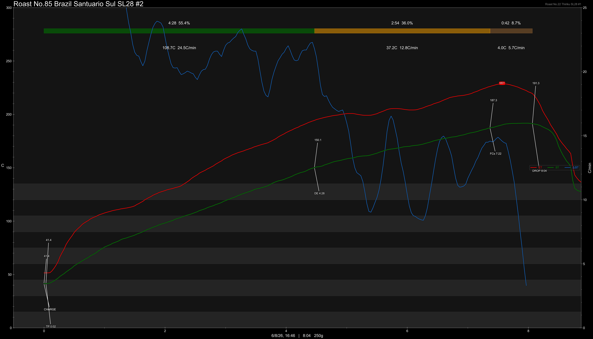
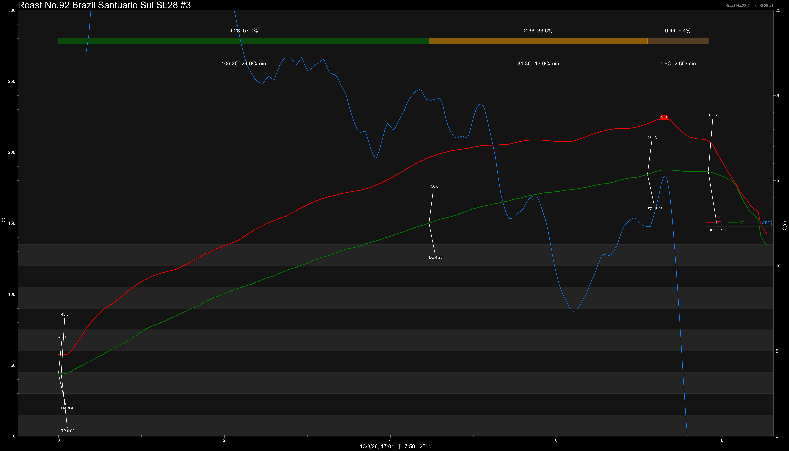
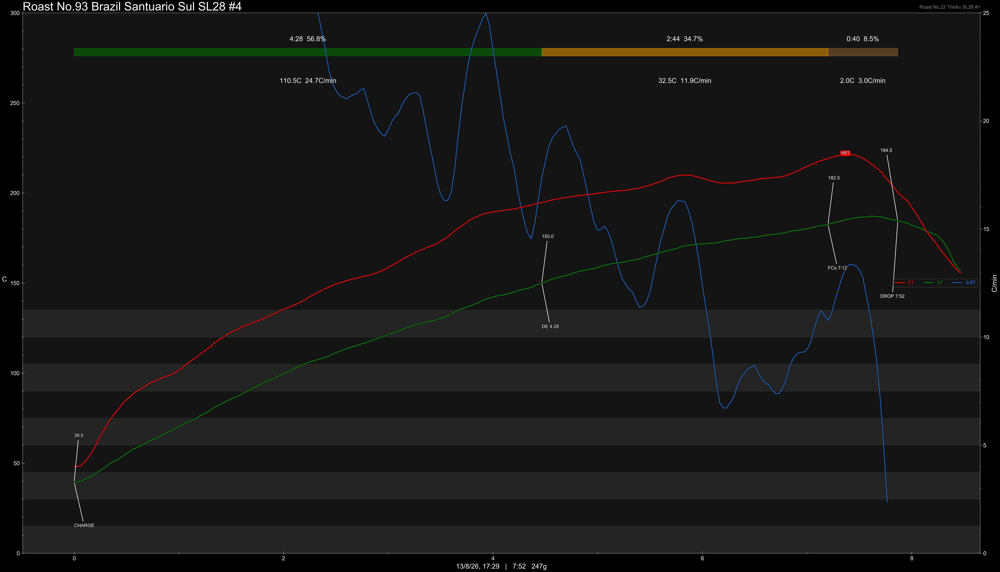

# Brazil Fazenda Santuario Sul SL28 Honey

Origin: Brazil

Region: Carmo De Minas

Farm / Station: Fazenda Santuario Sul

Producers: Luiz Paolo Dias Pereira Filho

Varietal: SL28

Process: Honey

Stock: -

Elevation (MASL): 1300

## Importer Information

Green Profile: Classic honey, high sweetness, pink chocolate milk, medium body

Grade: Screen 15up

Moisture: -

Density: -

Pricing Transparency (SGD):

    - Green Price: $31.3/KG
    - 9% GST: $2.817
    - Shipping: - (Local)

Importer: [2nd Mile Specialty](https://2ndmilespecialty.com/)

---

## Roast #1 6/8/2026

Weight Loss: 11.3%

QC3 Profile: milk chocolate, orange zest

## Roast #2 6/8/2026

Weight Loss: 12.5%

QC3 Profile: chocolate, lightly toasted nuts, orange zest

## Roast #3 13/8/2026

Weight Loss: 12.2%

QC3 Profile: -

## Roast #4 13/8/2026

Weight Loss: 11.9%

QC3 Profile: mixed berries, soft chocolate, smooth body

