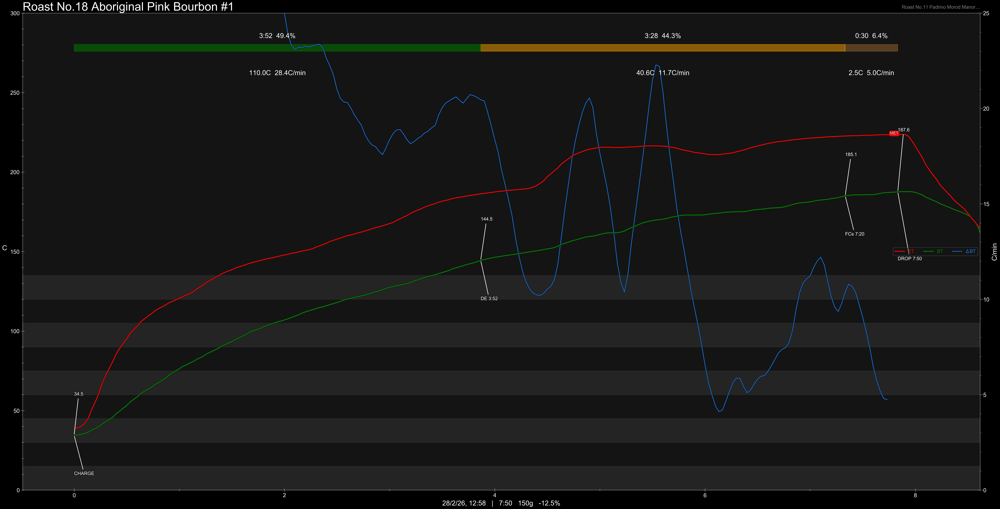
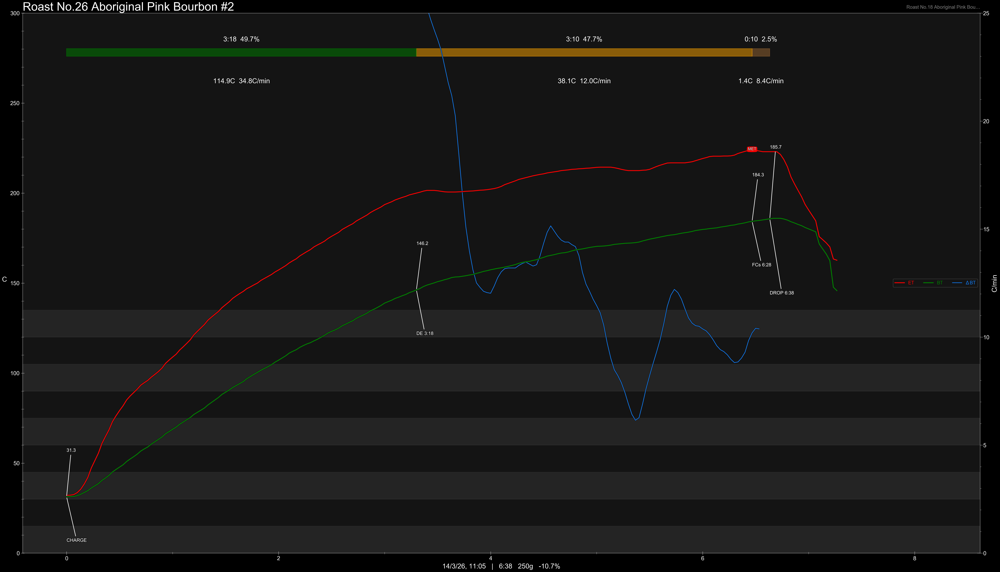
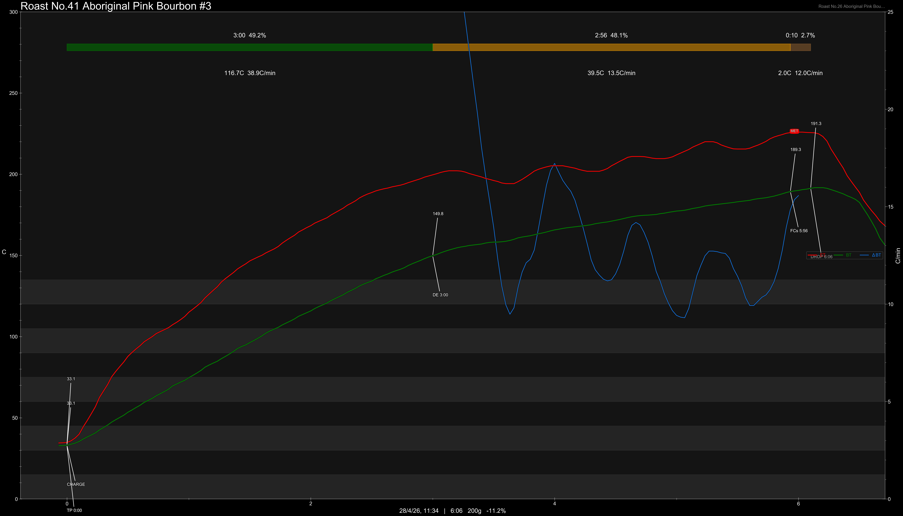
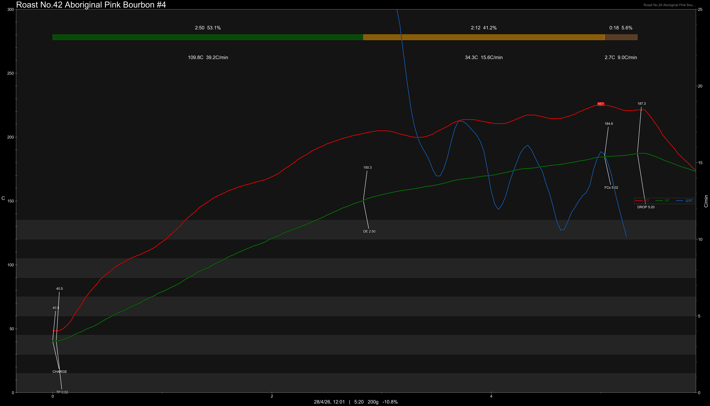
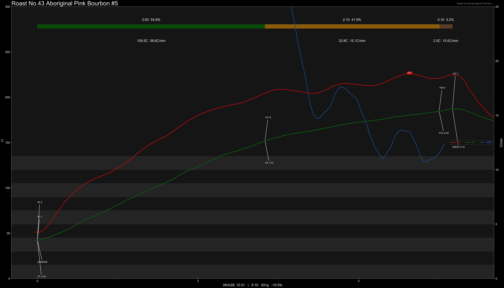

# Colombia Cauca Aboriginal Natural

Origin: Colombia

Region: Cauca

Farm / Station:

Producers: Aborigines

Varietal: Pink Bourbon

Process: Natural

Elevation (MASL): 1750-2000

Stock: -

## Importer Information

Green Profile: Cherry Pomegranate, Strawberry, Cream, Dried Grapes, Mulled Wine, Raspberries


Moisture: 10%

Density: 710g/L

Defect Rate: 4%

Pricing Transparency (SGD):

    - Green Price: $32.13/KG
    - 9% GST: $0.7
    - Shipping: $6.15 (Sea)

Importer: [Amativo](https://shop356669422.taobao.com)

---

## Roast #1 28/2/2026

Weight Loss: 12.5%

QC2 Profile: strawberry, red apple, red wine

## Roast #2 14/3/2026

Weight Loss: 10.7%

QC2 Profile: apple, strawberry, yoghurt, mulled wine

## Roast #3 28/4/2026

Weight Loss: 11.2%

QC2 Profile: -

## Roast #4 28/4/2026

Weight Loss: 10.8%

QC2 Profile: -

## Roast #5 28/4/2026

Weight Loss: 10.9%

QC2 Profile:

