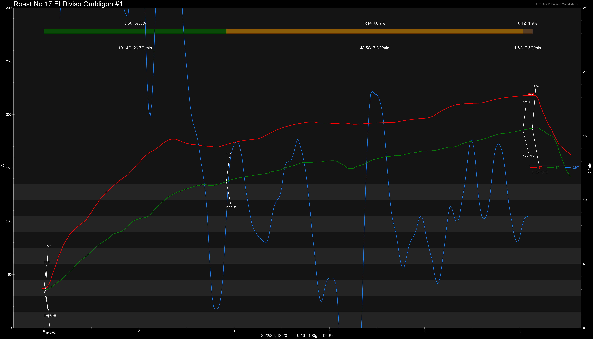
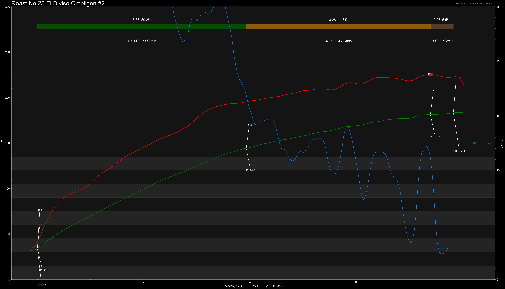
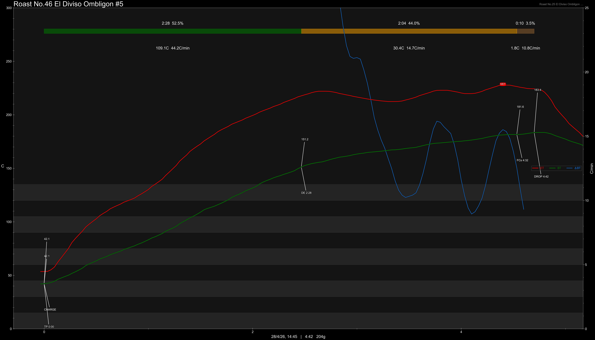

# Colombia El Diviso Ombligon Anaerobic Natural

Origin: Colombia

Region: Huila

Farm / Station: Finca El Diviso

Producers: Nestor Lasso

Varietal: Ombligon

Process: [Anaerobic Natural](https://prestacoffee.com/products/colombia-nestor-lasso-ombligon-anaerobic-natural)

Elevation (MASL): 1700

Stock: -

## Importer Information

Green Profile: Red Cherry, Grape, Yellow Peach, Liqueur, Blood Orange, Rose


Pricing Transparency (SGD):

    - Green Price: $50.74/KG
    - 9% GST: $0.7
    - Shipping: $6.15 (Sea)

Importer: [质能方程 Coffee Beans](https://shop571686704.m.taobao.com/?)

---

## Roast #1 28/2/2026

Weight Loss: 13%

QC2 Profile: yellow floral, pineapple, mandarine

## Roast #2 28/2/2026

Weight Loss: 12.3%

QC2 Profile: peach, roselle, honey, melon

## Roast #3 28/4/2026

Weight Loss: 12.8%

QC2 Profile: -

## Roast #4 28/4/2026

Weight Loss: 12.3%

QC2 Profile: -

## Roast #5 28/4/2026

Weight Loss: 11.6%

QC2 Profile:

