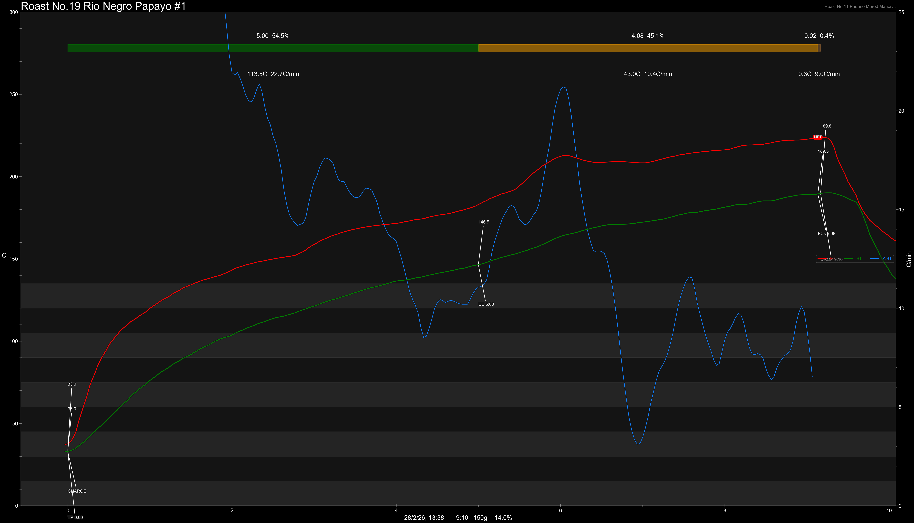
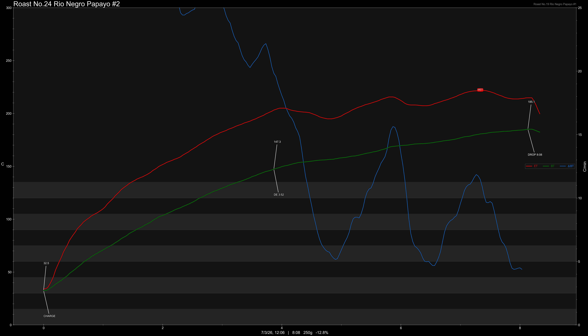
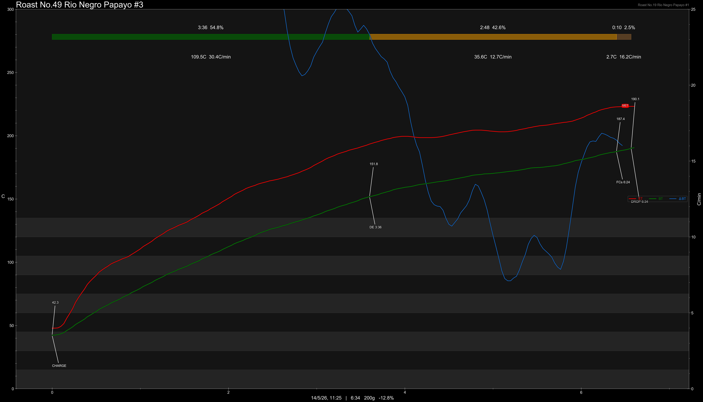
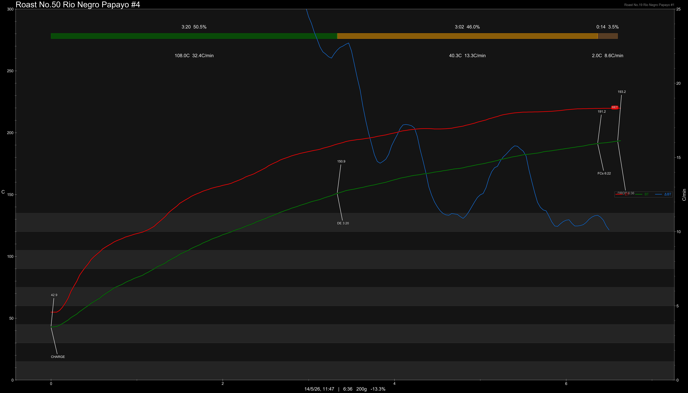
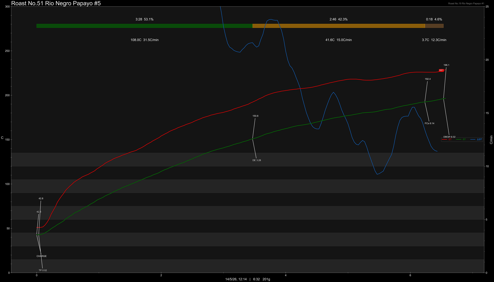

# Colombia Rio Negro Papayo Lactic Washed

Origin: Colombia

Region: Acevedo, Huila

Farm / Station: Rio Negro

Producers: Jhon Rodriguez

Varietal: Papayo

Process: Lactic Washed

Elevation (MASL): 1650

Stock: -

## Importer Information

Green Profile: Red Grape, Papaya, Cantaloupe, Tropical Fruit, Jasmine


Moisture: 11.1%

Density: 806g/L

Defect Rate: 2%

Pricing Transparency (SGD):

    - Green Price: $52.57/KG
    - 9% GST: $0.7
    - Shipping: $6.15 (Sea)

Importer: [Amativo](https://shop356669422.taobao.com)

---

## Roast #1 28/2/2026

Weight Loss: 14%

QC2 Profile: papaya, grapes, peach

## Roast #2 7/3/2026

Weight Loss: 12.5%

QC2 Profile: grape, lime, flower petals

## Roast #3 14/5/2026

Weight Loss: 12.8%

QC3 Profile: melon, yoghurt, grape kefir

## Roast #4 14/5/2026

Weight Loss: 13.3%

QC3 Profile: -

## Roast #5 14/5/2026

Weight Loss: 13.5%

QC3 Profile: grape, cream, dried pear

