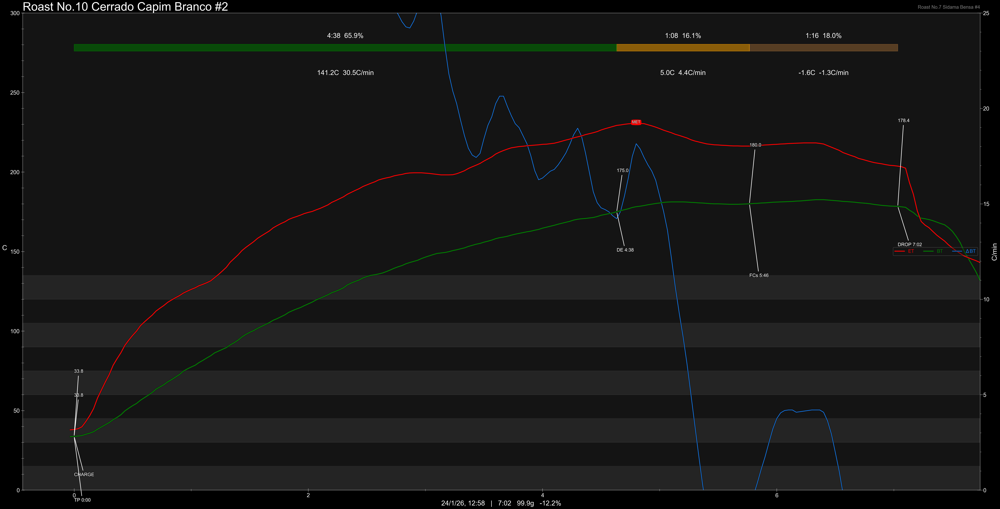

# Brazil Cerrado Capim Branco

Origin: Brazil

Region: Cerrado

Farm / Station: Capim Branco

Producer: Ismael & Eduardo Andrade

Varietal: [Yellow Catuai](https://www.jacoffee.com/products/brazil-yellow-catuai-from-fazenda-sao-luiz-cerrado-mineiro-natural-60kg-wholesale#:~:text=This%20natural%2Dprocessed%20Yellow%20Catuai,vibrant%20stone%20fruit%2Dlike%20acidity.), Yellow [Icatu](https://library.sweetmarias.com/glossary/icatu/)

Process: Natural

Elevation (MASL): 1100

Grade: No.2

## Importer Information

Green Profile: Caramel, Chocolate, Malt Taste, Clean

Moisture: 10.2%

Pricing Transparency (SGD):

    - Green Price: $20.42/KG
    - 9% GST: $2.1
    - Shipping: $3.99 (Sea)

Importer: [质能方程 Coffee Beans](https://shop571686704.m.taobao.com/?)

---

## Roast #1 24/1/2026

Weight Loss: 10%

Taste Profile:

## Roast #1 24/1/2026

Weight Loss: 12.2%

Taste Profile:

