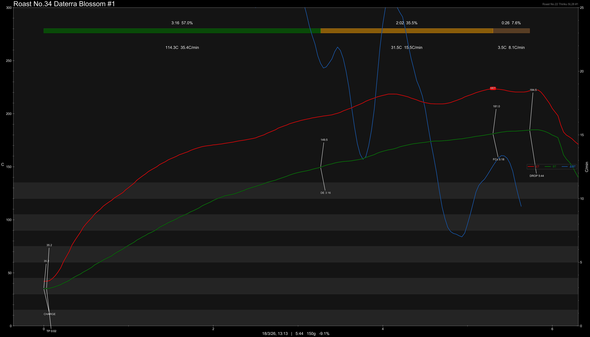

# Brazil Daterra Blossom Guarani & Aramosa Natural & Pulped

Origin: Brazil

Region: Daterra

Farm / Station: Boa Vista

Producers: Louis Pascoal

Varietal: Guarani & Aramosa

Process: Natural & Pulped

Elevation (MASL): 1150

## Importer Information

Green Profile: Red Tea, Red Sugar, Dried Fruits, Preservered Plums

Moisture: 10.2%

Density: 824g/L

Defect Rate: 6%

Season Year: 2026

Pricing Transparency (SGD):

    - Green Price: $35.87/KG
    - 9% GST: $3.09
    - Shipping: $3.64 (Sea)

Importer: [Ecofarm](https://shop415487444.taobao.com)

---

## Roast #1 18/3/2026

Weight Loss: 9.1%

QC2 Profile: grape, red tea, poached pear

