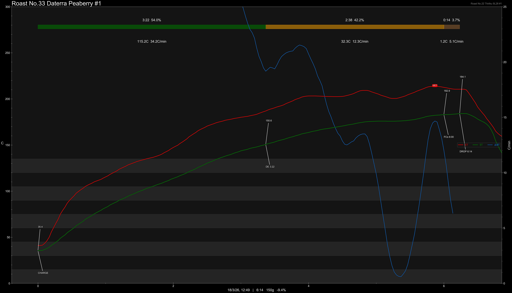

# Brazil Daterra Peaberry Natural & Pulped

Origin: Brazil

Region: Daterra

Farm / Station: Boa Vista & Tabuoes

Producers: Louis Pascoal

Varietal: Peaberry

Process: Natural & Pulped

Elevation (MASL): 1149

## Importer Information

Green Profile: Preserved Plums, Yellow Sugar, Apricot, Roasted Nuts

Moisture: 9.5%

Density: 842g/L

Defect Rate: 3.2%

Season Year: 2026

Pricing Transparency (SGD):

    - Green Price: $17.10/KG
    - 9% GST: $3.09
    - Shipping: $3.64 (Sea)

Importer: [Ecofarm](https://shop415487444.taobao.com)

---

## Roast #1 18/3/2026

Weight Loss: 9.4%

QC2 Profile: apple, pu'er tea, roasted hazelnut

