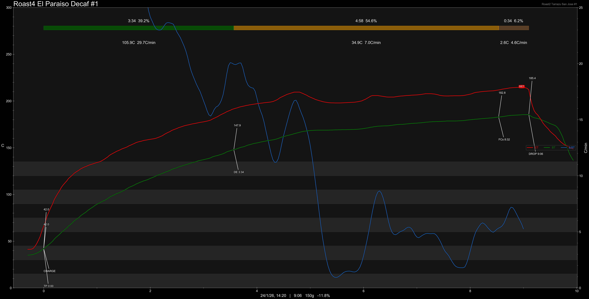

# Colombia El Paraiso Sugarcane Decaf

Origin: Colombia

Region: Cauca

Farm / Station: El Paraiso

Producers: Samuel Diego Bermudez

Varietal: Castillo

Process: EA Sugarcane Decaf

Elevation (MASL): 1930

## Importer Information

Green Profile: Sugarcane, Roasted Sweet Potato, Caramel

Moisture: 11.5%

Pricing Transparency (SGD):

    - Green Price: $32.53/KG
    - 9% GST: $3.37
    - Shipping: $8.82 (Air)

Importer: [Terroir Maximus](https://shop.m.taobao.com/shop/shop_index.htm?user_id=4030276869)

---

## Roast #1 24/1/2026

Weight Loss: 11.8%

Taste Profile:

