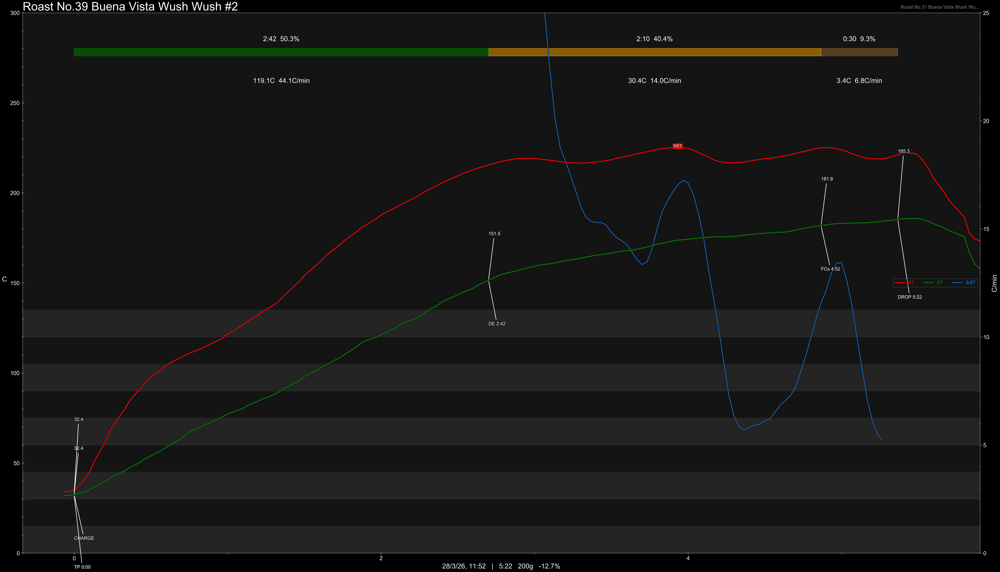
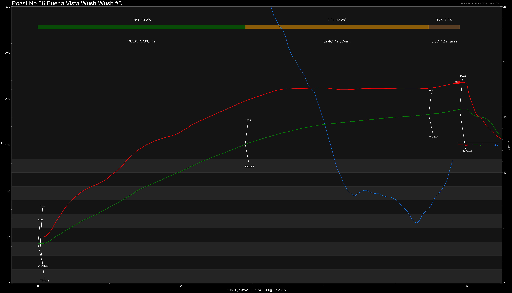
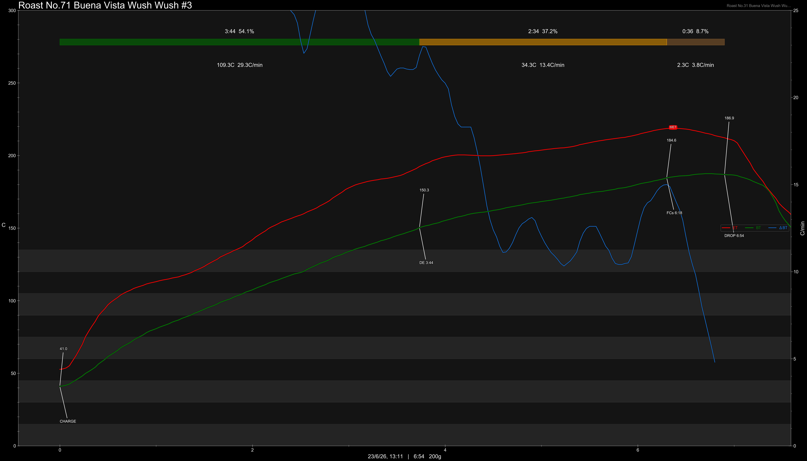

# Colombia Risaralda Wush Wush Fermentation Washed

Origin: Colombia

Region: Belén de Umbría – Risaralda

Farm / Station: Finca Buena Vista

Producers: Carlos Mario Gallego

Varietal: Wush Wush

Process: 72 Hour Controlled Fermentation Washed

Elevation (MASL): 2200

Stock: 250g

## Importer Information

Green Profile: Tangerine, Peach, Pear, White Grape

Moisture: 9.6%

Density: 821g/L

Crop Year: 2026

Pricing Transparency (SGD):

    - Green Price: $50.62/KG
    - 9% GST: $5.97
    - Shipping: $3.42 (Sea)

Importer: [品力非](https://shop286243613.m.taobao.com/)

---

## Roast #1 18/3/2026

Weight Loss: 11.8%

QC2 Profile: tangerine, mango, candied citrus

## Roast #2 28/3/2026

Weight Loss: 12.7%

QC2 Profile: -

## Roast #3 8/6/2026

Weight Loss: 12.7%

QC3 Profile: plum, red wine, poached grapes

## Roast #4 23/6/2026

Weight Loss: 13.2%

QC3 Profile: -

