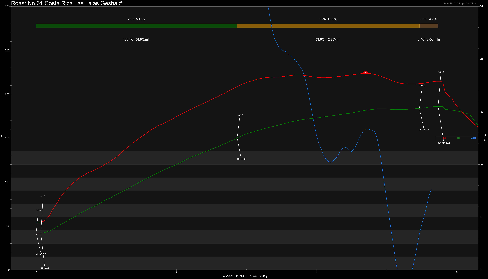

# Costa Rica Las Lajas Gesha Natural

Origin: Costa Rica

Region: Sabanilla de Alajuela, Central Valley

Farm / Station: Las Lajas

Producers: Oscar and Francisca Chacón

Varietal: Gesha

Process: Natural

Elevation (MASL): 1400 - 1600

Stock: 250g

## Importer Information

Green Profile: Jasmine, Grape, Raspberry, Mulberry, Juicy

Moisture: 11.5%

Density: - g/L

Season Year: 2026

Pricing Transparency (SGD):

    - Green Price: $18.66/kg
    - 9% GST: $1.96
    - Shipping: $3.38 (Air)

Importer: [玩豆咖啡](https://shop480596741.taobao.com)

---

## Roast #1 26/5/2026

Weight Loss: 11.6%

QC3 Profile: jasmine, honey, mulberry

