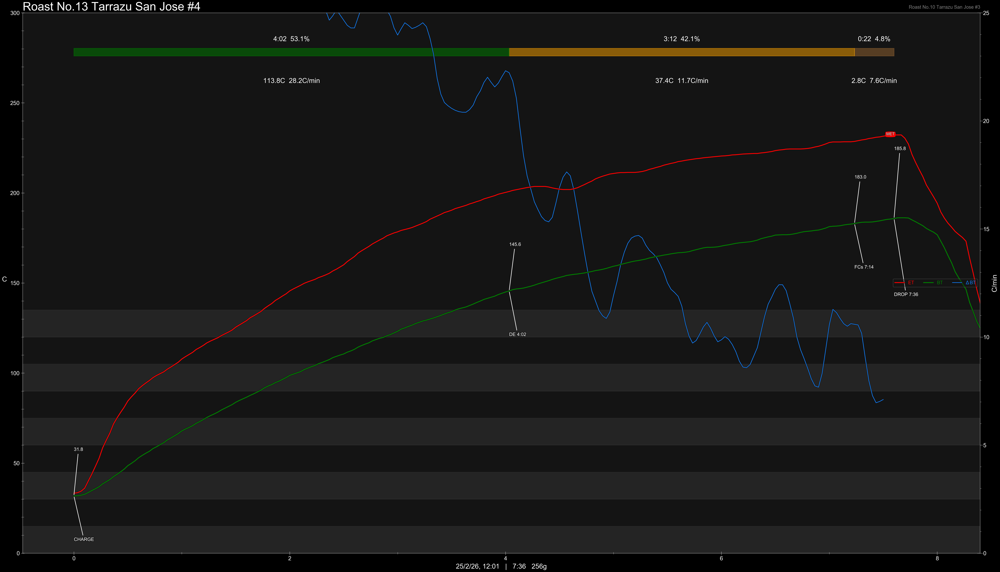

# Costa Rica Tarrazu San Jose Jaguar Red Honey

Origin: Costa Rica

Region: Tarrazu

Farm / Station: San Jose

Producers: Smallholders

Varietal: Caturra, Catuai

Process: Red Honey

Elevation (MASL): 1600-1900

## Importer Information

Green Profile: Honey, Melon, Pomegranate

Moisture: 10.7%

Density: 878g/L

Pricing Transparency (SGD):

    - Green Price: $27.79/KG
    - 9% GST: $2.1
    - Shipping: $3.99 (Sea)

Importer: [质能方程 Coffee Beans](https://shop571686704.m.taobao.com/?)

---

## Roast #1 24/1/2026

Weight Loss: 10.8%

Taste Profile: pear, apple but very muted and light

## Roast #2 9/2/2026

Weight Loss: 10.7%

QC2 Profile: pleasant honey, melon, pear

## Roast #3 22/2/2026

Weight Loss: 11.4%

QC2 Profile: grapes, plum, pear

## Roast #4 25/2/2026

Weight Loss: 12.1%

QC2 Profile: honey, melon, grapes

