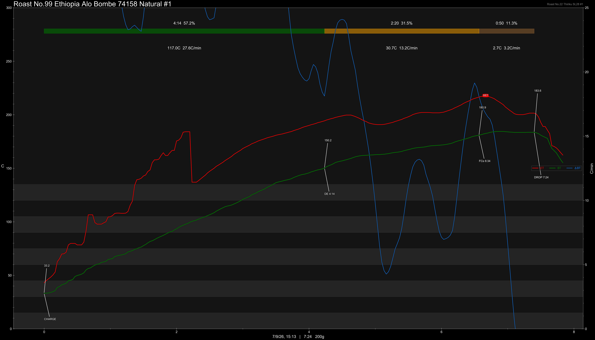

# Ethiopia Alo Safo Bombe 74158 Natural

Origin: Ethiopia

Region: Sidama

Farm / Station: Alo Safo

Producers: Bombe Single Farmer

Varietal: 74158

Process: Natural

Elevation (MASL): 2410

Stock: 800g

## Importer Information

Green Profile: Jasmine, Rose, Peach, Mango, Kyoho Grape, Soda

Moisture: 9%

Density: 852g/L

Season Year: 2026

Pricing Transparency (SGD):

    - Green Price: $31.92/KG
    - 9% GST: $3.21
    - Shipping: $3.76 (Air)

Importer: [品力非](https://shop286243613.m.taobao.com/)

---

## Roast #1 7/9/2026

Weight Loss: 11%

QC3 Profile: grapes, lychee, fruit candy

## Roast #2 x/x/2026

Weight Loss: %

QC3 Profile:

## Roast #3 x/x/2026

Weight Loss: %

QC3 Profile:

## Roast #4 x/x/2026

Weight Loss: %

QC3 Profile:

## Roast #5 x/x/2026

Weight Loss: %

QC3 Profile:

