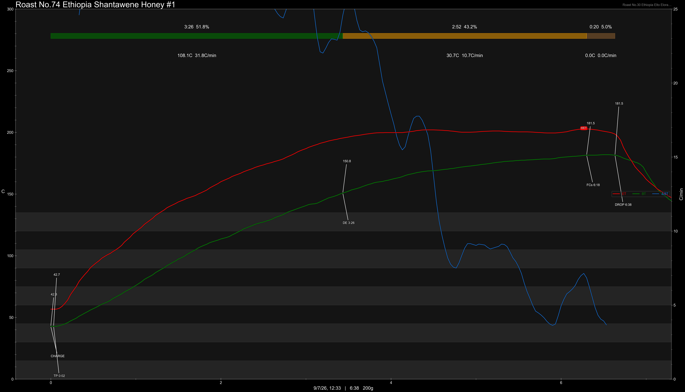

# Ethiopia Sidama Shantawene 74158 & 74112 Honey Thermal Shock

Origin: Ethiopia

Region: Sidama

Farm / Station: Shantawene

Producers: And Coffee

Varietal: 74158 & 74112

Process: Honey Thermal Shock

Elevation (MASL): 2080-2280

Stock: 800g

Award: AFCA Regional TOH #1 in Honey Arabica Category

## Importer Information

Green Profile: Pink Rose, Mandarin Orange, White Peach, Lychee

Moisture: 8.9%

Density: 864g/L

Season Year: 2026

Pricing Transparency (SGD):

    - Green Price: $84.49/KG
    - 9% GST: $7.90
    - Shipping: $7.93 (Air)

Importer: [Hansun Coffee](https://shop292857517.taobao.com)

---

## Roast #1 9/7/2026

Weight Loss: 9.8%

QC3 Profile: mango candy, peach, nectarines

## Roast #2 x/x/2026

Weight Loss: %

QC3 Profile:

## Roast #3 x/x/2026

Weight Loss: %

QC3 Profile:

## Roast #4 x/x/2026

Weight Loss: %

QC3 Profile:

## Roast #5 x/x/2026

Weight Loss: %

QC3 Profile:

