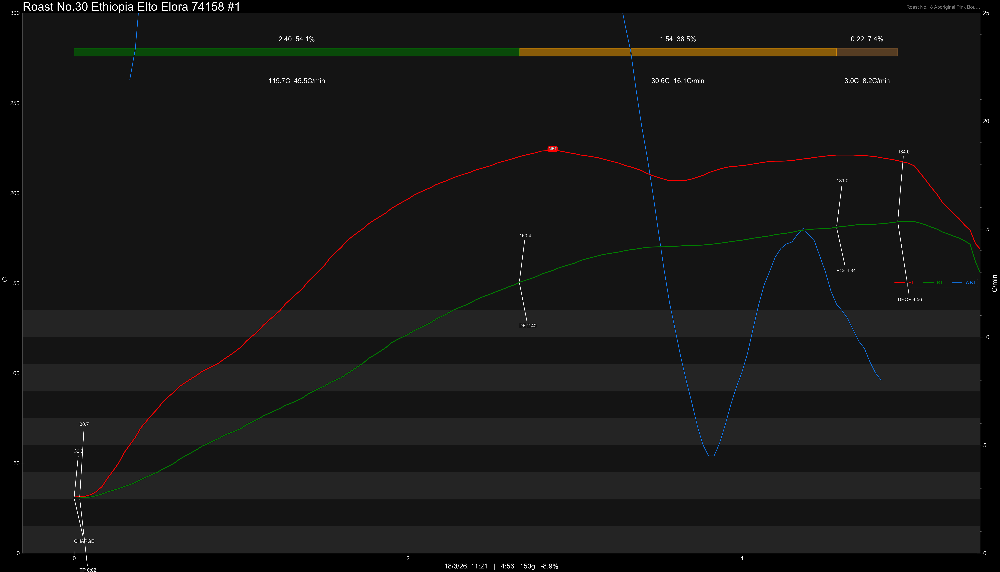

# Ethiopia Elto Elora Station 74158 Cold Fermentation Washed

Origin: Ethiopia

Region: Sidama

Farm / Station: Elto Elora Station

Producers: Eliyas Dukamo & Atiklit Dejene

Varietal: 74158

Process: Cold Fermentation Washed

Elevation (MASL): 2000-2300

Stock: 850g

## Importer Information

Green Profile: Violet, White Flower, Peach, Mango, Fruit Candy

Moisture: 9.6%

Density: 856g/L

Crop Year: 2025

Pricing Transparency (SGD):

    - Green Price: $62.5/KG
    - 9% GST: $5.97
    - Shipping: $3.42 (Sea)

Importer: [品力非](https://shop286243613.m.taobao.com/)

---

## Roast #1 18/3/2026

Weight Loss: 8.9%

QC2 Profile: purple flower, lavendar, grapes

