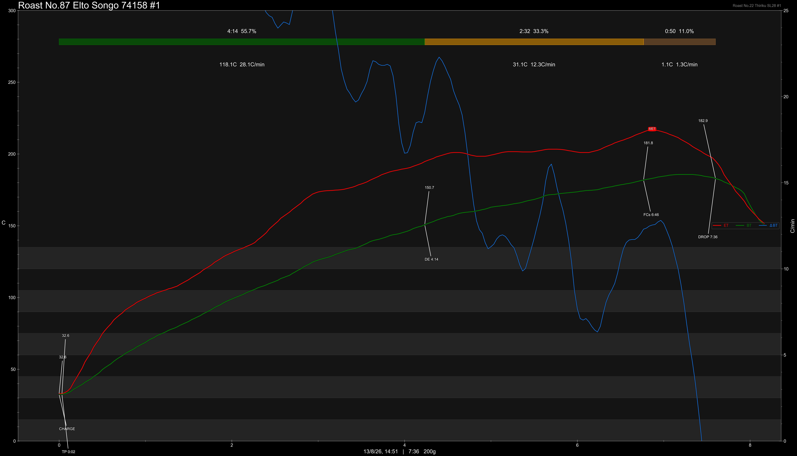

# Ethiopia Elto Songo Station 74158 Washed

Origin: Ethiopia

Region: Sidama

Farm / Station: Elto Songo

Producers: Eliyas Dukamo & Atiklit Dejene

Varietal: 74158

Process: Washed

Elevation (MASL): 2000-2350

Stock: 800g

## Importer Information

Green Profile:

Moisture: -%

Density: -g/L

Season Year: 2026

Pricing Transparency (SGD):

    - Green Price: $54.75/KG
    - 9% GST: -
    - Shipping: -

Importer: [品力非](https://shop286243613.m.taobao.com/)

---

## Roast #1 13/8/2026

Weight Loss: 12%

QC3 Profile: lemon, pear, tangy citrus

## Roast #2 x/x/2026

Weight Loss: %

QC3 Profile:

## Roast #3 x/x/2026

Weight Loss: %

QC3 Profile:

## Roast #4 x/x/2026

Weight Loss: %

QC3 Profile:

## Roast #5 x/x/2026

Weight Loss: %

QC3 Profile:

