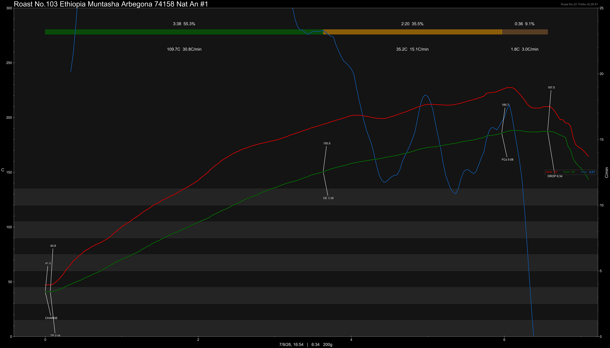

# Ethiopia Muntasha Arbegona Sidama 74158 Natural Anaerobic

Origin: Ethiopia

Region: Sidama

Farm / Station: Muntasha Arbegona

Producers: Muntasha Farmers

Varietal: 74158

Process: Natural Anaerobic

Elevation (MASL): 2250-2450

Stock: 800g

## Importer Information

Green Profile: Florals, Passionfruit, Grape, Lychee, Blackcurrant, Fruit Juice

Moisture: -%

Density: -g/L

Season Year: 2026

Pricing Transparency (SGD):

    - Green Price: $57.78/KG
    - 9% GST: $5.30
    - Shipping: $4.30 (Sea)

Importer: [QO Coffee](https://shop326667862.m.taobao.com)

---

## Roast #1 7/9/2026

Weight Loss: 11.8%

QC3 Profile: light florals, passionfruit, blackcurrant

## Roast #2 x/x/2026

Weight Loss: %

QC3 Profile:

## Roast #3 x/x/2026

Weight Loss: %

QC3 Profile:

## Roast #4 x/x/2026

Weight Loss: %

QC3 Profile:

## Roast #5 x/x/2026

Weight Loss: %

QC3 Profile:

