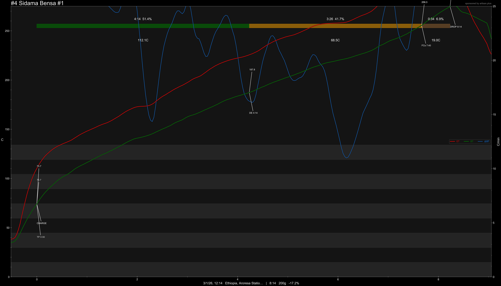

# Ethiopia Sidama Bensa Aroresa

Origin: Ethiopia

Region: Sidama Bensa

Station: Aroresa Station

Varietal: JARC 74158

Process: Natural Sun Dried

Elevation (MASL): 1900-2000

Green Profile: Clean, Sweet, Floral, Mandarin, Black Tea, Stone Fruit, Berries

Pricing Transparency (SGD):

    - Green Price: $21/KG
    - 9% GST: $1.89

Importer: [2nd Mile Specialty](https://2ndmilespecialty.com/)

---

**Note**

Mastech M6514 was set to N-type probe reading so Roast #1 & #2 are inaccurate in temperature reading.

---

---

Cupping Profile:

## Roast #1

## Roast #2

