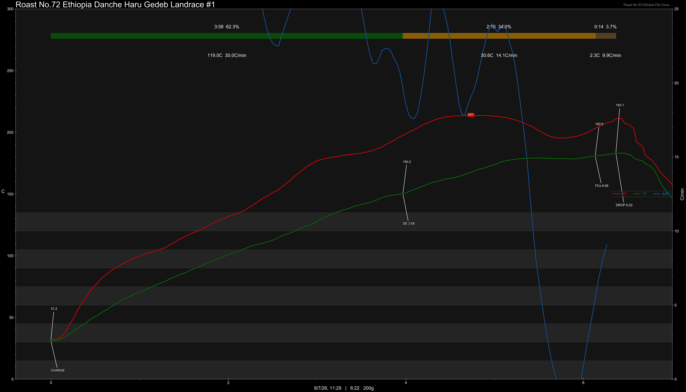

# Ethiopia Danche Haru Chelbesa Gedeb Yirgacheffe Landrace Washed Slow Dry

Origin: Ethiopia

Region: Yirgacheffe

Farm / Station: Danche Haru

Producers: Smallholders

Varietal: Ethiopian Landrace

Process: Washed Slow Dry

Elevation (MASL): 2300+

Stock: 800g

## Importer Information

Green Profile: Florals, Tangerines, Melon, Longjing Tea

Moisture: -%

Density: -g/L

Season Year: 2026

Pricing Transparency (SGD):

    - Green Price: $54.75/KG
    - 9% GST: $5.32
    - Shipping: $7.52 (Air)

Importer: [QO Coffee](https://shop326667862.m.taobao.com)

---

## Roast #1 9/7/2026

Weight Loss: 9.3%

QC3 Profile: light florals, citrus, melon

## Roast #2 x/x/2026

Weight Loss: %

QC3 Profile:

## Roast #3 x/x/2026

Weight Loss: %

QC3 Profile:

## Roast #4 x/x/2026

Weight Loss: %

QC3 Profile:

## Roast #5 x/x/2026

Weight Loss: %

QC3 Profile:

