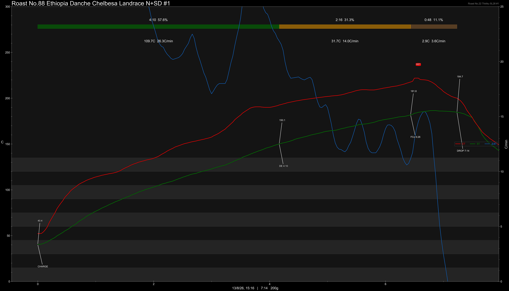
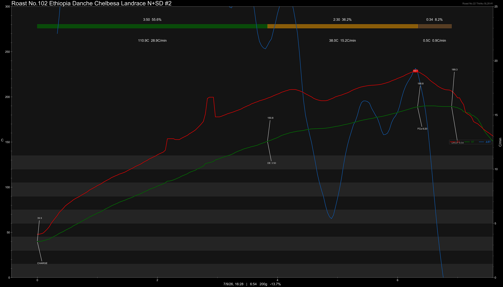

# Ethiopia Danche Haru Chelbesa Gedeb Yirgacheffe Landrace Natural Slow Dry

Origin: Ethiopia

Region: Yirgacheffe

Farm / Station: Danche Haru

Producers: Smallholders

Varietal: Ethiopian Landrace

Process: Natural Slow Dry

Elevation (MASL): 2300+

Stock: 800g

## Importer Information

Green Profile:

Moisture: -%

Density: -g/L

Season Year: 2026

Pricing Transparency (SGD):

    - Green Price: $54.75/KG
    - 9% GST: -
    - Shipping: -

Importer: [QO Coffee](https://shop326667862.m.taobao.com)

---

## Roast #1 13/8/2026

Weight Loss: 12.7%

QC3 Profile: apples, purple grapes, white florals

## Roast #2 7/9/2026

Weight Loss: 13.7%

QC3 Profile: plums, cherry, black tea

## Roast #3 x/x/2026

Weight Loss: %

QC3 Profile:

## Roast #4 x/x/2026

Weight Loss: %

QC3 Profile:

## Roast #5 x/x/2026

Weight Loss: %

QC3 Profile:

