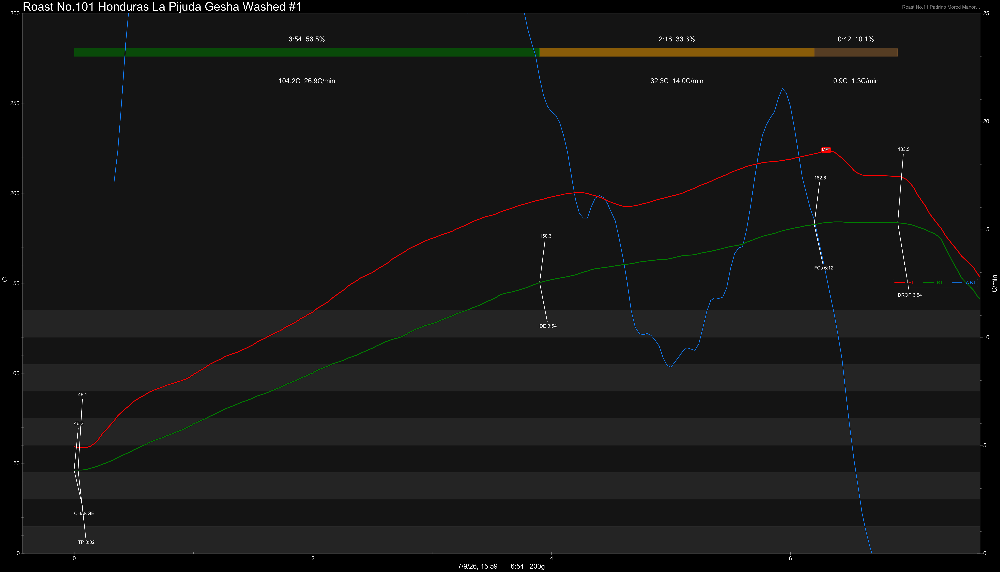

# Honduras La Pijuda Gesha Washed

Origin: Honduras

Region: Zurzular / Cantarranas

Farm / Station: La Pijuda

Producers: Rafael Segura Ponce

Varietal: Gesha

Process: Washed

Elevation (MASL): 1600

Stock: 800g

## Importer Information

Green Profile: Jasmine, Cherry, Plum, Red Grpes, Nectarine, Honey

Moisture: 9.2%

Density: 830/L

Season Year: 2026

Pricing Transparency (SGD):

    - Green Price: $84.77/KG
    - 9% GST: $7.91
    - Shipping: $9.27 (Air)

Importer: [品力非](https://shop286243613.m.taobao.com/)

---

## Roast #1 7/9/2026

Weight Loss: 10.5%

QC3 Profile: white florals, pears, pomegranate

## Roast #2 x/x/2026

Weight Loss: %

QC3 Profile:

## Roast #3 x/x/2026

Weight Loss: %

QC3 Profile:

## Roast #4 x/x/2026

Weight Loss: %

QC3 Profile:

## Roast #5 x/x/2026

Weight Loss: %

QC3 Profile:

