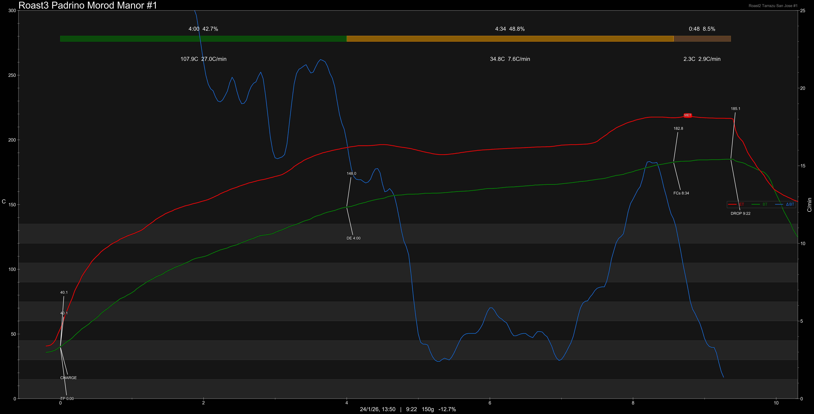

# Honduras Padrino Morod Manor

Origin: Honduras

Region: Padrino

Farm / Station: Morod Manor

Varietal: Caturra

Process: Whisky Barrel Fermentation

Elevation (MASL): 1600

## Importer Information

Green Profile: Whisky, Cream, Vanilla, Macaron

Moisture: 11.5%

Pricing Transparency (SGD):

    - Green Price: $32.64/KG
    - 9% GST: $3.59
    - Shipping: $7.86 (Air)

Importer: [Borong Coffee](https://shop.m.taobao.com/shop/shop_index.htm?user_id=2838426638)

---

## Roast #1 24/1/2026

Weight Loss: 12.7%
Taste Profile:

