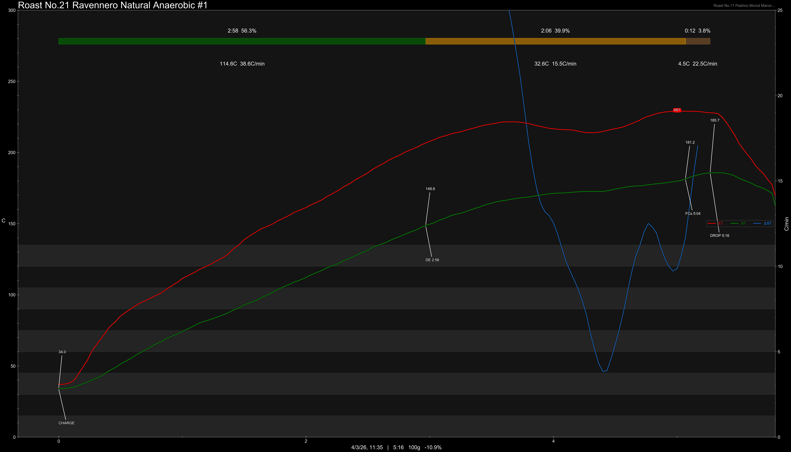
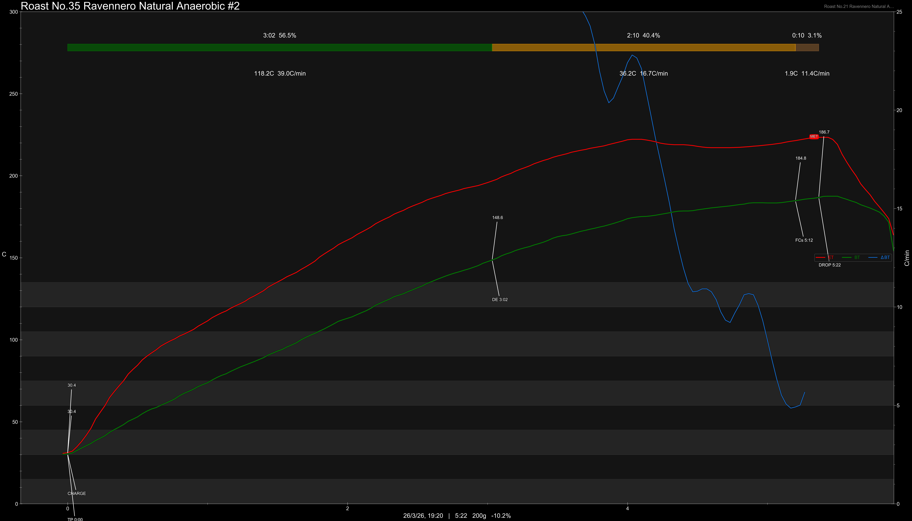

# Indonesia Ravennero Java Natural Anaerobic Slow Drying 168 Hours

Origin: Indonesia

Region: Gewor, East Manglayang

Farm / Station: Ravennero

Producers: Ravennero

Varietal: Java

Process: Natural Anaerobic Slow Drying 168 Hours

Elevation (MASL): 1600

## Importer Information

Green Profile: Lychee, Red Berries, Grapes, Orange, Pineapple, Complex & Rich

Code: 408

Grade: Supreme

Pricing Transparency (SGD):

    - Green Price: $25/KG
    - 9% GST: -
    - Shipping: -

Importer: Valdy

---

## Roast #1 4/3/2026

Weight Loss: 10.9%

QC2 Profile: longan, red wine, stewed apple

## Roast #2 26/3/2026

Weight Loss: 10.2%

QC2 Profile: -

