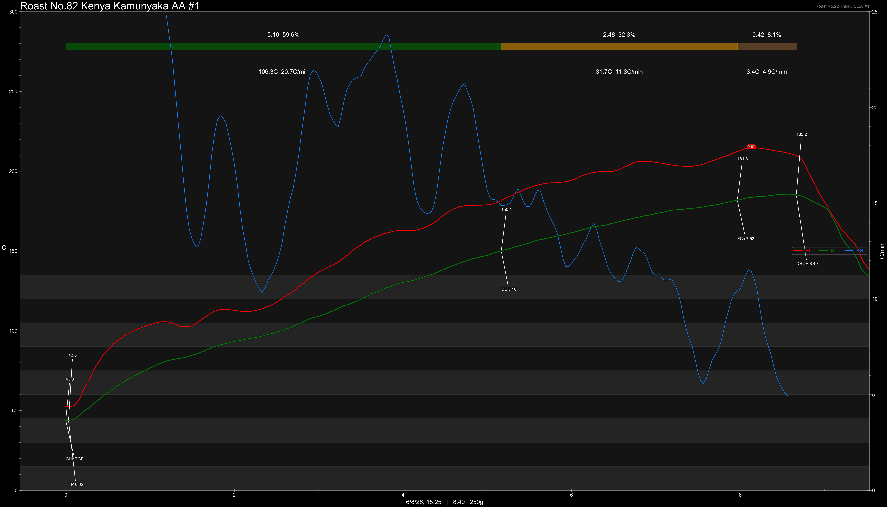
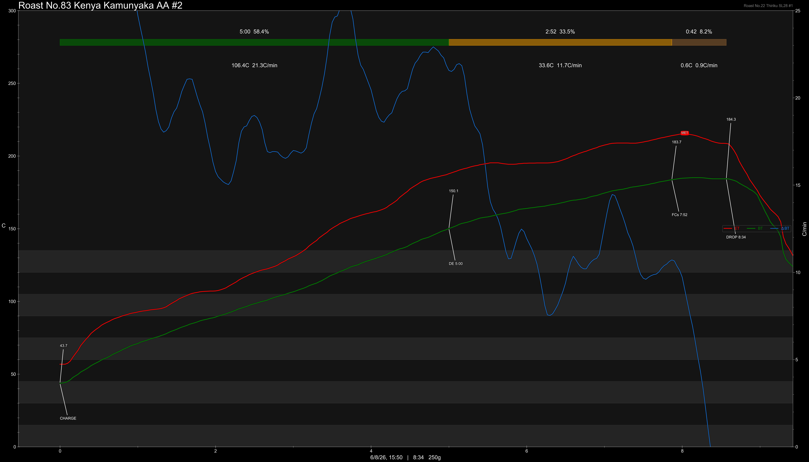

# Kenya Kamunyaka AA Fully Washed

Origin: Kenya

Region: Nyeri

Farm / Station: Kamunyaka Station

Producers: Iria-ini Farmers Cooperatives Society

Varietal: SL28, SL34

Process: Fully Washed

Stock: 500g

Elevation (MASL): 1700-1800

## Importer Information

Green Profile: Milk Chocolate, White Floral, Lime Zest, Milky

Grade: AA

Moisture: -

Density: -

Pricing Transparency (SGD):

    - Green Price: $33.9/KG
    - 9% GST: $3.051
    - Shipping: - (Local)

Importer: [2nd Mile Specialty](https://2ndmilespecialty.com/)

---

## Roast #1 6/8/2026

Weight Loss: 11.2%

QC3 Profile: soft fruit punch, creamy, mixed berries

## Roast #2 6/8/2026

Weight Loss: 11.1%

QC3 Profile: -

## Roast #3 x/x/2026

Weight Loss: %

QC3 Profile:

## Roast #4 x/x/2026

Weight Loss: %

QC3 Profile:

