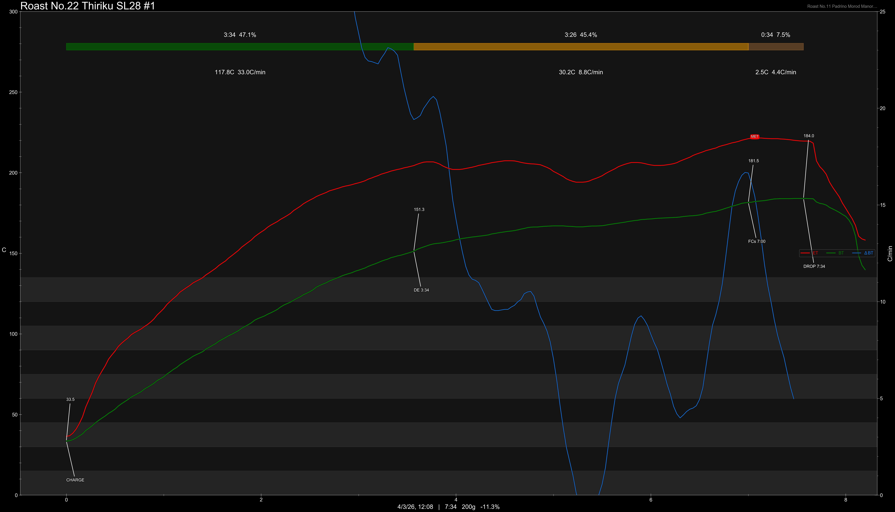

# Kenya Thiriku SL28 K72 Double Washed

Origin: Kenya

Region: Nyeri

Farm / Station: Thiriku Washing Station

Producers: Thiriku Cooperative

Varietal: SL28

Process: [K72 Double Washed](https://world.gafei.com/coffee130499.html)

Elevation (MASL): 1880-1970

## Importer Information

Green Profile: Orange, Lime, Plum, Lemongrass, Red Tea, Candied Sweets

Grade: AA Top

Moisture: 9.3%

Density: 852g/L

Pricing Transparency (SGD):

    - Green Price: $37.9/KG
    - 9% GST: $3.74
    - Shipping: $5.74 (Sea)

Importer: [品力非](https://shop286243613.m.taobao.com/)

---

## Roast #1 4/3/2026

Weight Loss: 11.3%

Taste Profile: pomegranate, tangerine, candied lemon

