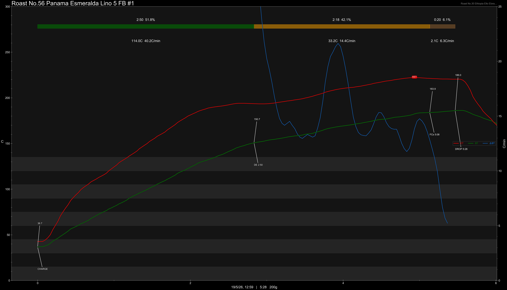
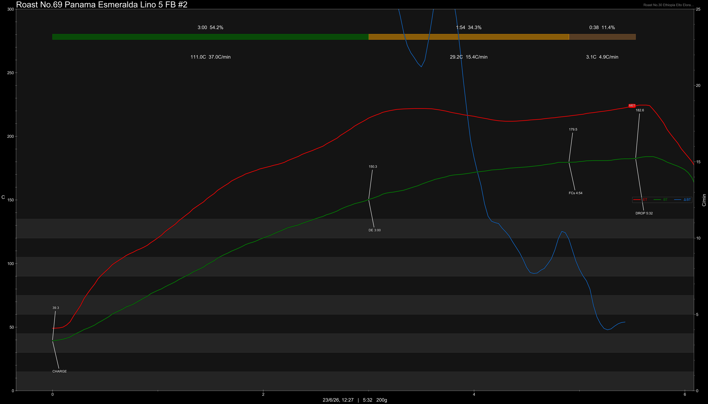
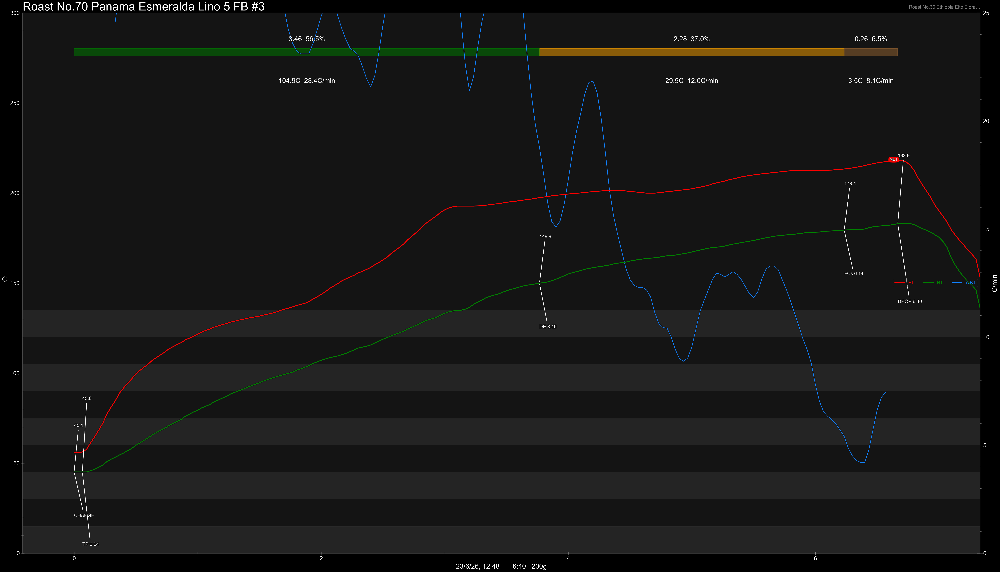

# Panama Hacienda La Esmeralda Gesha Cold Fermentation Slow Dry Washed

Origin: Panama

Region: Boquete, Chiriqui

Farm / Station: Hacienda La Esmeralda - Cañas Verdes Farm - Lino

Producers: Peterson Family

Varietal: Gesha

Process: Cold Fermentation Slow Dry Washed

Elevation (MASL): 1700+

Stock: 400g

Lot: Lino

Additional Information: 5th Harvest Round / Lot, Fermentation Batch

## Importer Information

Green Profile: Florals, Tangerine, Peach, Red Sugar

Moisture: 10.3%

Density: 816.8g/L

Season Year: 2026

Pricing Transparency (SGD):

    - Green Price: $438.74/kg
    - 9% GST: $38.50
    - Shipping: $9.76 (Air)

Importer: [Coffee Camps](https://shop61530016.taobao.com)

---

## Roast #1 19/5/2026

Weight Loss: 10.5%

QC3 Profile: florals, tangerine, nectar honey

## Roast #2 23/6/2026

Weight Loss: 11.5%

QC3 Profile: -

## Roast #3 23/6/2026

Weight Loss: 10.6%

QC3 Profile: -

