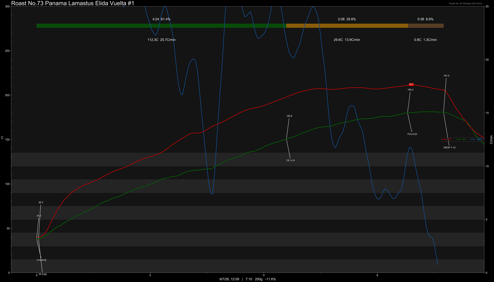

# Panama Lamastus Elida Vuelta Gesha Washed Dark Room Dry

Origin: Panama

Region: Boquete

Farm / Station: Lamastus Elida Vuelta

Producers: Willford Lamastus

Varietal: Gesha

Process: Washed Dark Room Dry

Elevation (MASL): 1900-1950

Stock: 800g

## Importer Information

Green Profile: Coffee Flower, White Peach, Orange Blossom, Mango, Magnolia

Moisture: 9.2%

Density: 839g/L

Season Year: 2026

Pricing Transparency (SGD):

    - Green Price: $332.94/KG
    - 9% GST: $29.68
    - Shipping: $6.66 (Air)

Importer: [品力非](https://shop286243613.m.taobao.com/)

---

## Roast #1 9/7/2026

Weight Loss: 10.8%

QC3 Profile: heavy florals, lychee

## Roast #2 x/x/2026

Weight Loss: %

QC3 Profile:

## Roast #3 x/x/2026

Weight Loss: %

QC3 Profile:

## Roast #4 x/x/2026

Weight Loss: %

QC3 Profile:

## Roast #5 x/x/2026

Weight Loss: %

QC3 Profile:

