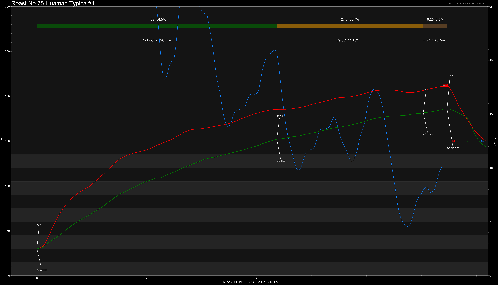
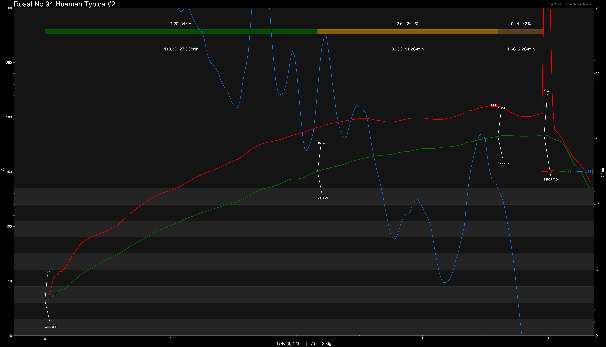
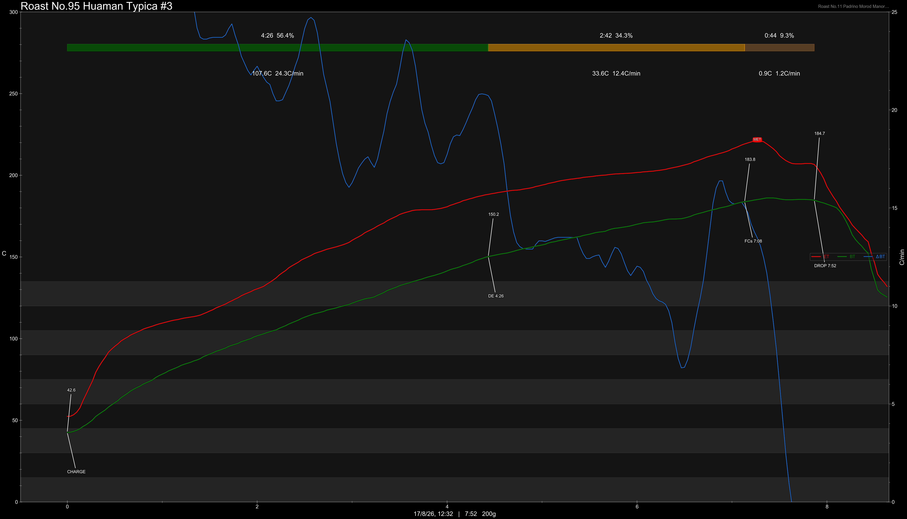

# Peru Cusco Huaman Typica Washed

Origin: Peru

Region: Challabamba, Paucartambo, Cusco

Farm / Station: Family Huaman

Producers: Small Producers

Varietal: Typica

Process: Washed

Elevation (MASL): 2050

Stock: 400g

## Importer Information

Green Profile: Almonds, Nuts, White Chocolate, Cream

Moisture: 9.5%

Density: 826g/L

Season Year: 2026

Pricing Transparency (SGD):

    - Green Price: $29.37/KG
    - 9% GST: $3.07
    - Shipping: $6.60 (Air)

Importer: [品力非](https://shop286243613.m.taobao.com/)

---

## Roast #1 31/7/2026

Weight Loss: 10%

QC3 Profile:

## Roast #2 17/8/2026

Weight Loss: 10.5%

QC3 Profile: -

## Roast #3 17/8/2026

Weight Loss: 11%

QC3 Profile: -

## Roast #4 x/x/2026

Weight Loss: %

QC3 Profile:

## Roast #5 x/x/2026

Weight Loss: %

QC3 Profile:

