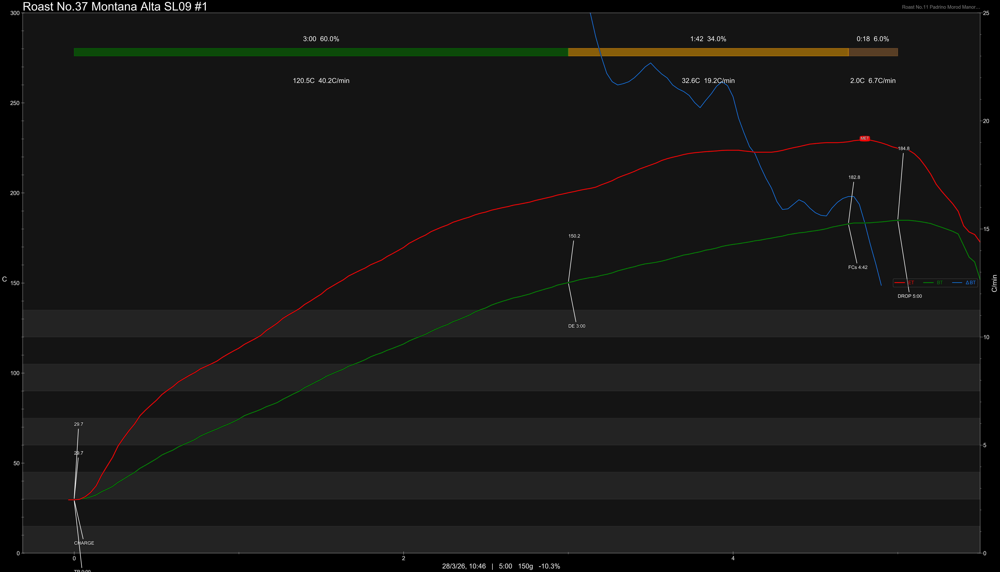

# Peru Montana Alta SL09 Geisha Washed

Origin: Peru

Region: Inkawasi

Farm / Station: Montana Alta

Producers: Jaime Huayllas

Varietal: SL09 Geisha

Process: Washed

Elevation (MASL): 2350

Lot: \#1

## Importer Information

Green Profile: Lemon, Plum, White Florals, Stone Fruits

Moisture: 9.3%

Density: 815g/L

Season Year: 2026

Pricing Transparency (SGD):

    - Green Price: $82.71/kg
    - 9% GST: $10.48
    - Shipping: $5.76 (Sea)

Importer: [品力非](https://shop286243613.m.taobao.com/)

---

## Roast #1 28/3/2026

Weight Loss: 10.1%

QC2 Profile: lemon tea, white florals, honey

