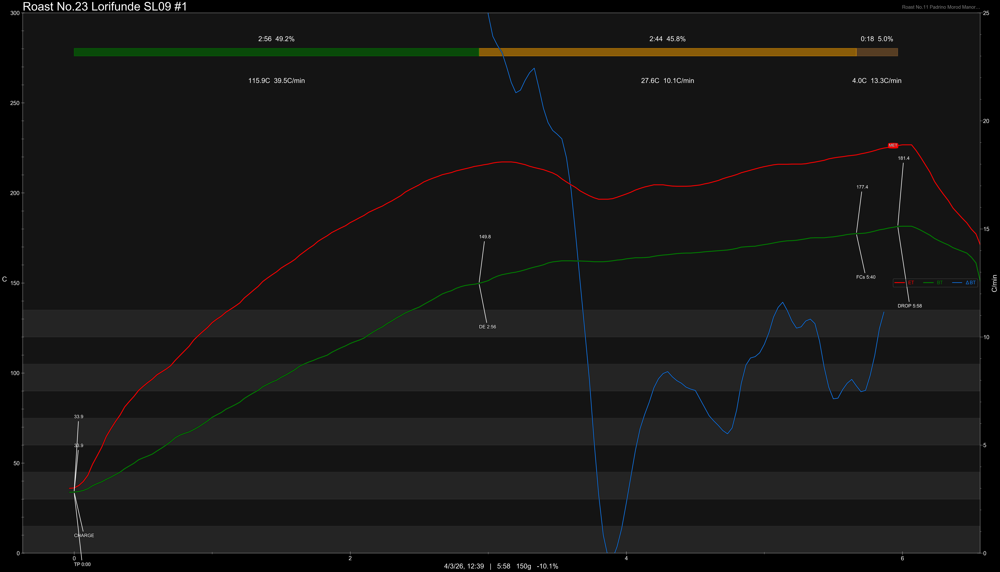

# Peru Finca Lorifunde SL09 Geisha Washed

Origin: Peru

Region: Cusco

Farm / Station: Finca Lorifunde

Producers: Isaias

Varietal: SL09 Geisha

Process: Washed

Elevation (MASL): 2296

## Importer Information

Green Profile: Jasmine, Mango, Peach, Loquat, Black Tea

Moisture: 9.3%

Density: 843g/L

Pricing Transparency (SGD):

    - Green Price: $37.9/500g
    - 9% GST: $3.74
    - Shipping: $2.87 (Sea)

Importer: [品力非](https://shop286243613.m.taobao.com/)

---

## Roast #1 4/3/2026

Weight Loss: 10.1%

Taste Profile: white florals, mango, dragonfruit

