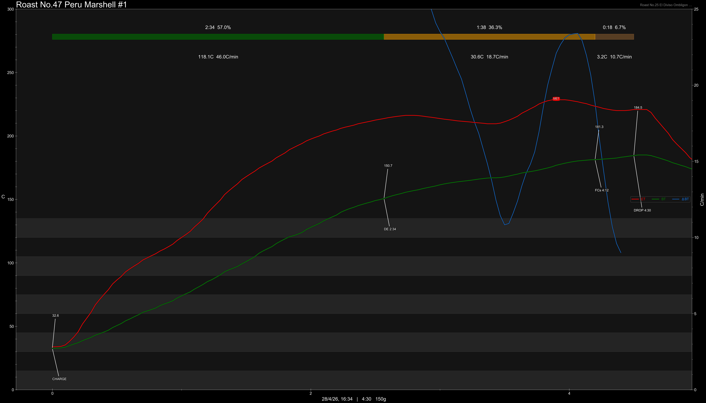

# Peru Finca El Morito Marshell Natural

Origin: Peru

Region: Cajamarca

Farm / Station: Finca El Morito

Producers: David Flores

Varietal: Marshell

Process: Natural

Elevation (MASL): 1700 - 2000

Stock: 150g

## Importer Information

Green Profile: -

Moisture: -

Density: -

Roaster Profile: Dried Raspberry, Dried Pineapple, Brown Sugar, Black Forest

Pricing Transparency (SGD):

    - Green Price: -
    - 9% GST: -
    - Shipping: -

Importer: 

Given By: [Grounds on a Hill](https://maps.app.goo.gl/37LZ6wBxvoJwdxkq5)

---

## Roast #1 28/4/2026

Weight Loss: 10.1%

QC3 Profile: melon, honey, pear

