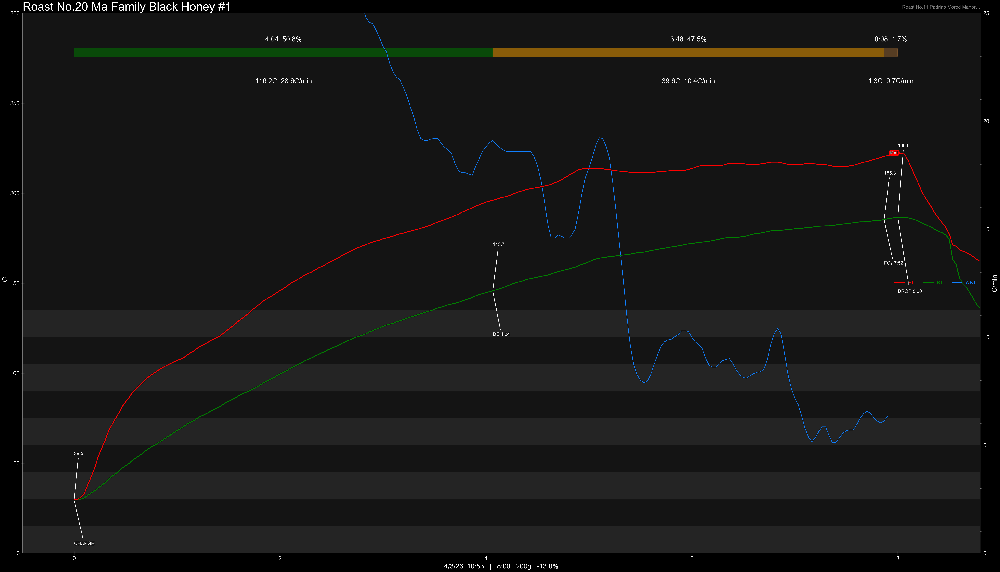
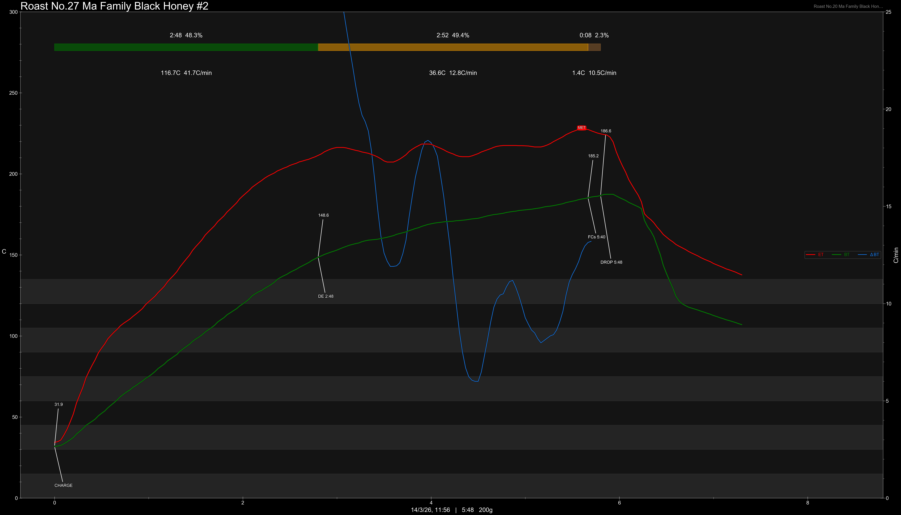
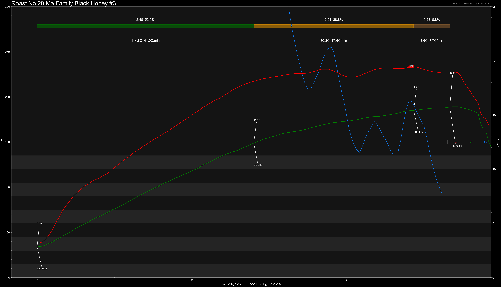
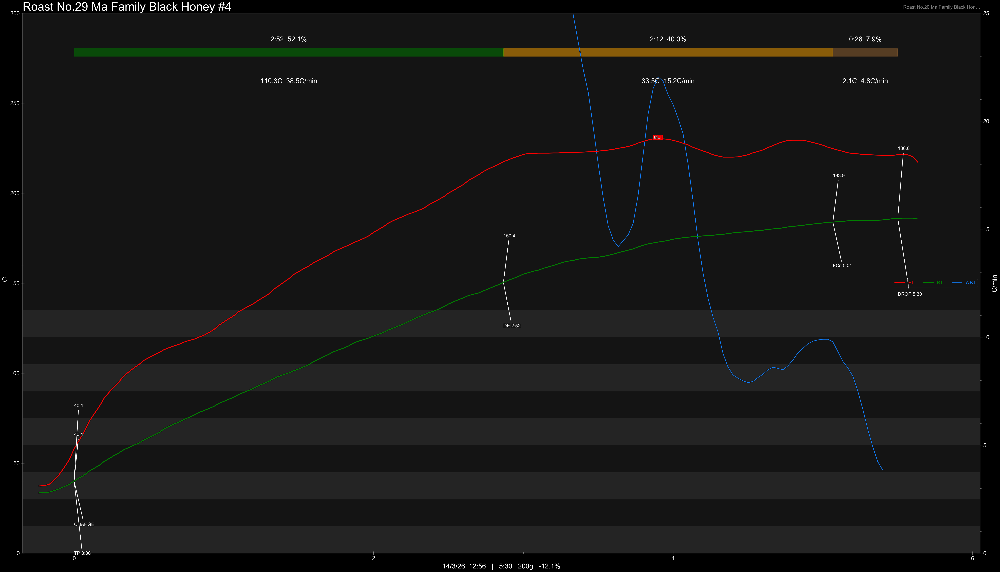

# Thailand Chiang Rai Ma Family Black Honey

Origin: Thailand

Region: Chiang Rai

Farm / Station: Ma Family

Producers: Ma Family

Varietal: Catimor, Bourbon, Catuai

Process: Black Honey

Elevation (MASL): 1200-1500

## Importer Information

Green Profile: Citrus, Orange, Brown Sugar, Oolong Tea

Pricing Transparency (SGD):

    - Green Price: $37.76/KG
    - 9% GST: -
    - Shipping: -

Importer: [Green Bean Intertrade](https://greenbeanintertrade.co/)

---

## Roast #1 4/3/2026

Weight Loss: 13%

QC2 Profile: apple, white grapes, brown sugar

## Roast #2 14/3/2026

Weight Loss: 11.7%

QC2 Profile: orange, brown sugar

## Roast #3 14/3/2026

Weight Loss: 12.2%

QC2 Profile: orange, brown sugar, apple skin

## Roast #3 14/3/2026

Weight Loss: 12.2%

QC2 Profile: orange, brown sugar

